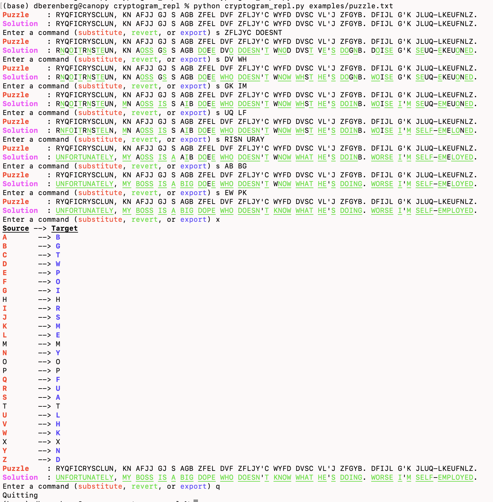

# cryptogram REPL

Solve NYT cryptogram puzzles easier

usage: `cryptogram_repl.py [-h] puzzle_file`

You have 3 commands:

### `substitute STRING1 STRING2`
Add entries to your cipher. Accepts two same-length capitalized strings. (e.g., `substitute ABCD EFGH`).
Other aliases: `sub`, `s`.

### `revert STRING`
Revert a set of characters back so they map to themselves in the cipher (e.g., `revert ABCDEF`. 
Other aliases: `rev`, `r`.

### `export`

Export the cipher you've created.

positional arguments:
  puzzle_file  Input puzzle as a single-line text file.

options:
  -h, --help   show this help message and exit
